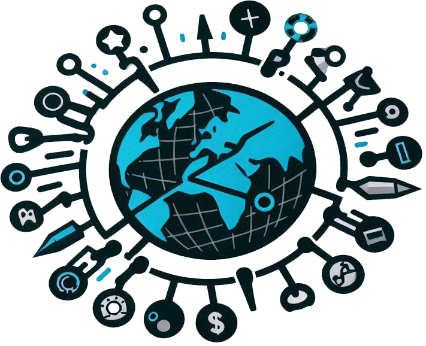

# Sistema Automatizado de Gestión de Problemas y Necesidades (SAGPN)

## Tabla de Contenido
- [Introducción](#introducción)
- [Características](#características)
- [Modelos del Sistema](#modelos-sistema)
- [Estructura del Proyecto](#estructura)
- [Licencia](#licencia)

# 🚀 **SAGPN (Sistema Automatizado de Gestión de Problemas y Necesidades)** {#introducción}

**SAGPN** es un sistema automatizado diseñado para gestionar problemas y necesidades en una empresa de manera eficiente. Este sistema permite a los usuarios crear tickets, asignar tareas, recibir notificaciones en tiempo real y generar reportes gráficos para analizar el rendimiento de los técnicos.

---

## 📋 **Problemática**

En muchas empresas, la gestión manual de problemas y necesidades puede resultar ineficiente, propensa a errores y lenta. **SAGPN** resuelve esta problemática al automatizar el proceso de creación, asignación y seguimiento de tickets, optimizando así la comunicación entre clientes, técnicos y gestores de tareas.

---

## 🌟 **Características Principales** {#características}

- **Creación de Tickets**: Los clientes pueden crear tickets para reportar problemas o necesidades.
- **Asignación de Tareas**: Los gestores de tareas pueden asignar tareas directamente a técnicos específicos.
- **Notificaciones en Tiempo Real**: Sistema de notificaciones mediante WebSockets para alertar sobre nuevos tickets o tareas.
- **Reportes Gráficos**: El gestor de tareas tiene acceso a reportes visuales para analizar el desempeño individual y general de los técnicos.
- **Gestión de Usuarios**: El gestor de tareas puede crear nuevos usuarios dentro del sistema.

---

## 🧑‍💻 **Tipos de Usuarios**

El sistema cuenta con tres tipos de usuarios principales:

1. **Cliente**
   - Crea tickets para reportar problemas o necesidades.
   - Recibe notificaciones sobre el estado de sus tickets.

2. **Técnico**
   - Recibe tareas asignadas por el gestor de tareas.
   - Actualiza el estado de las tareas completadas.

3. **Gestor de Tareas**
   - Asigna tareas a técnicos específicos.
   - Crea tickets directamente si es necesario.
   - Visualiza reportes gráficos sobre el rendimiento de los técnicos.
   - Gestiona la creación de nuevos usuarios.

---

## 🛠️ **Modelos del Sistema** {#modelos-sistema}

### **Tickets**
| Campo              | Tipo           | Descripción                                   |
|--------------------|----------------|-----------------------------------------------|
| ID                 | PrimaryKey     | Identificador único del ticket               |
| Cliente            | ForeignKey     | Usuario cliente que crea el ticket           |
| Técnico Asignado   | ForeignKey     | Técnico asignado para resolver el ticket     |
| Situación a Resolver| CharField     | Breve descripción del problema               |
| Área de Empresa    | CharField      | Departamento o área afectada                 |
| Descripción        | TextField      | Detalles completos del problema              |
| Fecha de Creación  | DateTimeField  | Fecha y hora de creación del ticket          |
| Prioridad          | CharField      | Nivel de prioridad (Baja, Media, Alta)       |
| Realizada          | BooleanField   | Indica si el ticket ha sido resuelto         |

### **Usuario**
| Campo              | Tipo           | Descripción                                   |
|--------------------|----------------|-----------------------------------------------|
| ID                 | PrimaryKey     | Identificador único del usuario              |
| Nombre             | CharField      | Nombre del usuario                           |
| Apellidos          | CharField      | Apellidos del usuario                        |
| Rol                | CharField      | Rol del usuario (Cliente, Técnico, Gestor)   |

---

## 🏗️ **Estructura del Proyecto** {#estructura}
- **Framework**: Django
- **Interfaz de Usuario**: Django templates, Bootstrap
- **Base de Datos**: SQLite
- **Interactividad**: HTMX
- **Gráficos**: HighCharts

---
